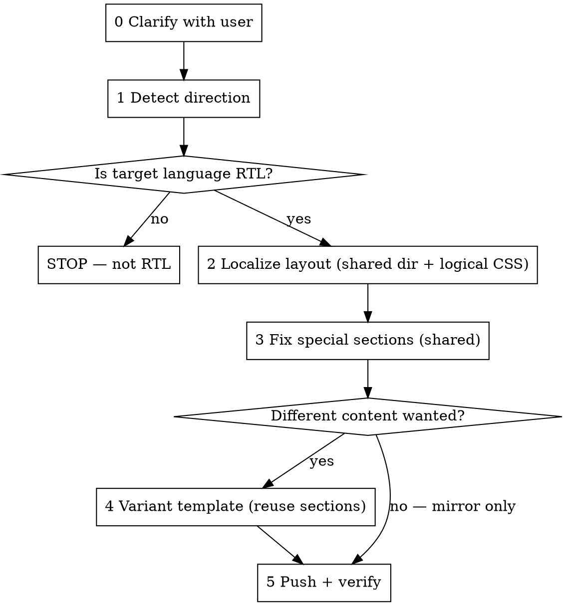

# RTL localization

Company: {{company.name}}

Localize a **file-based** Fluid theme so an RTL-language market reads correctly right-to-left.
The invariant goal is **the layout is localized to the market** — mirrored via `dir` + CSS
logical properties on the *shared* theme, not by rebuilding or copying anything. Whether the
market also gets *different content* is a question for the user, not a default.

**Core principles:**
- **Always localize the layout; ask about content.** Direction localization runs every time.
  Different content only happens if the user asks for it in Phase 0.
- **Mirror on the shared theme.** `dir` + logical CSS in `layouts/theme.liquid` and shared
  `sections/*` — this localizes every page at once.
- **Never copy sections to flip them.** Duplicating the PDP's sections into RTL copies is
  thousands of lines that immediately drift. Mirroring is CSS/`dir`, not duplication.

RTL **horizontal** only (Arabic-family). Vertical/CJK top-to-bottom is out of scope.
Surface: **file-based themes only** (`product/default/index.liquid` + `sections/*`). If the
company's theme is API-managed instead, STOP and say so — the mechanism differs and guessing
leaves an orphan template.

## When to Use

- A company is opening into an RTL-language market and its file-based storefront reads LTR.
- Text stays left-aligned, nav/logo sit on the wrong side, or carousels point the wrong way.

**Do NOT use for:** vertical CJK text, a non-RTL language, API-managed themes, or pure copy
translation (that's the `translating-theme-languages` skill).

## The Workflow

Work one phase at a time. **Stop for a review checkpoint after each phase.**

### Phase 0 — Clarify with the user (interactive flow)
Do not infer. Ask:
1. **Which market/language?** (Confirm; Phase 1 verifies it's RTL.)
2. **Same content mirrored, or different content for this market?** Make clear the layout gets
   localized either way — this only decides whether content also changes. Default is
   same-content-mirrored.
3. If **different content**: what specifically differs, and confirm they accept that a variant
   template is a separate copy that won't auto-inherit future edits to the default.
4. Confirm the theme is **file-based** and locate the theme directory.

### Phase 1 — Detect direction
Resolve the market's language → direction via `references/direction-map.md`. Key on **language**,
not country. Not in the RTL set → **STOP**.

### Phase 2 — Localize the layout (always)
Edit the **shared** theme, not a copy. See `references/fluid.md`.
1. In `layouts/theme.liquid`, set `dir` on `<html>` from the active locale
   (`dir="rtl"` when `localization.language` is RTL, else `ltr`). Drive it from the locale —
   never hardcode.
2. Convert physical CSS to logical properties in the theme's shared CSS so the layout mirrors:

| Physical (LTR-only) | Logical (direction-aware) |
|---|---|
| `margin-left` / `margin-right` | `margin-inline-start` / `margin-inline-end` |
| `padding-left` / `padding-right` | `padding-inline-start` / `padding-inline-end` |
| `left:` / `right:` | `inset-inline-start` / `inset-inline-end` |
| `text-align: left` / `right` | `text-align: start` / `end` |
| `border-left` / `border-right` | `border-inline-start` / `border-inline-end` |
| `float: left` / `right` | `float: inline-start` / `inline-end` |

### Phase 3 — Fix special sections (in place, no copies)
Hand-fix the shared components logical CSS can't flip using `references/special-sections.md`
(carousels, directional icons, image↔text splits, breadcrumbs, hardcoded positions) with
`[dir=rtl]` overrides on the existing sections. Keep numbers, prices, and Latin embeds LTR (bidi).

### Phase 4 — Variant template (ONLY if the user chose different content)
Skip entirely for mirror-only. If different content was requested, create a variant template
folder (e.g. `product/<variant>/index.liquid`) that **reuses the shared sections** with a
different order/settings, adding at most a single market section. Do not fork the section files.
See `references/fluid.md`.

### Phase 5 — Push + verify
Push the theme, then load the storefront in the RTL locale and check: text right-aligned,
nav/logo mirrored, icons/carousels point the correct way, spacing mirrored, and numbers/prices
stay LTR (bidi). Screenshot before/after.

## Common Mistakes

- **Copying sections to flip them** — mirroring is `dir` + logical CSS on shared sections, not
  duplication. Copies drift immediately.
- **Editing a copy instead of the shared theme for mirroring** — Phase 2 is shared-theme work.
- **Assuming different content** — always ask in Phase 0; default is same-content-mirrored.
- **Wrong surface** — this is file-based only; STOP on API-managed themes to avoid an orphan.
- **Hardcoding `dir="rtl"`** instead of driving it from the locale.
- **Forgetting bidi** — numbers/prices/URLs must stay LTR inside an RTL layout.

## References

- `references/direction-map.md` — language → direction lookup (the RTL set).
- `references/special-sections.md` — the exception-component checklist and fixes.
- `references/fluid.md` — file-based theme specifics: where `dir`/CSS go, `localization.language`, variant templates, and pushing.
