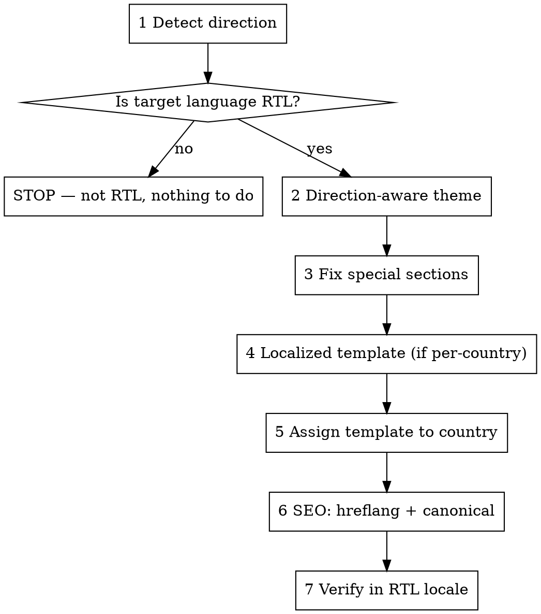

# RTL localization

Company: {{company.name}} · API base: {{company.api_base}}

Make {{company.name}}'s storefront render right-to-left for an RTL-language market **without
duplicating markup**. The layout mirrors from a single source: set `dir="rtl"` on the root from
the active locale, use CSS *logical properties* so physical left/right flip automatically, then
hand-fix the components that carry baked-in LTR assumptions ("special sections").

**Core principle:** direction is data, not a redesign. One direction-aware theme serves both
LTR and RTL; you never maintain a mirrored copy of every page.

RTL **horizontal** only (Arabic-family). Vertical/CJK top-to-bottom is out of scope.

## When to Use

- {{company.name}} transacts primarily in an RTL-language market and the storefront still
  reads left-to-right.
- Text stays left-aligned, the nav/logo sit on the wrong side, or carousels/back-buttons point
  the wrong way in an RTL locale.
- A market needs its own localized template served per country (see the Fluid appendix —
  `ThemeRegionRule`).

**Do NOT use for:** vertical CJK text, or a language that isn't RTL. Always confirm direction
first (Phase 1) — Japanese, Chinese, and Korean are LTR on the modern web, not RTL.

## The Workflow

Work one phase at a time. **Work on a branch. Stop for a review checkpoint after each phase —
do not chain phases.**

### Phase 1 — Detect direction
Resolve the target language → direction using `references/direction-map.md`. Key on **language**,
not country (Arabic is RTL whether Saudi or Egyptian). If the language is not in the RTL set,
**STOP** — there is nothing to localize for direction.

### Phase 2 — Make the theme direction-aware
Edit the template's `content` (Liquid) and `stylesheet` (CSS) via
`PATCH {{company.api_base}}/api/application_theme_templates/:id` — see `references/fluid.md`.
1. Set `dir` on the root element from the active locale: `dir="rtl"` when the locale is RTL,
   else `dir="ltr"`. Do this once in the layout — never hardcode per page.
2. Convert physical CSS to logical properties so the layout mirrors automatically:

| Physical (LTR-only) | Logical (direction-aware) |
|---|---|
| `margin-left` / `margin-right` | `margin-inline-start` / `margin-inline-end` |
| `padding-left` / `padding-right` | `padding-inline-start` / `padding-inline-end` |
| `left:` / `right:` | `inset-inline-start` / `inset-inline-end` |
| `text-align: left` / `right` | `text-align: start` / `end` |
| `border-left` / `border-right` | `border-inline-start` / `border-inline-end` |
| `float: left` / `right` | `float: inline-start` / `inline-end` |

Leave truly physical things alone; icons are handled in Phase 3.

### Phase 3 — Fix special sections
Logical CSS mirrors the box model but not everything. Enumerate and hand-fix the exception
components using `references/special-sections.md` (carousels/sliders, image↔text splits,
step/progress indicators, directional icons, breadcrumbs, hardcoded-position elements).

### Phase 4 — Localized template (only if serving a per-country variant)
Clone the target template into an RTL variant rather than editing the shared one:
`POST {{company.api_base}}/api/application_theme_templates/:id/clone`, edit, then
`POST …/:id/publish`. See `references/fluid.md`.

### Phase 5 — Assign the template to the country ("the router")
Bind country → localized template with a region rule:
`POST {{company.api_base}}/api/theme_region_rules` (`region_code: "SA"`,
`application_theme_template_id`). See `references/fluid.md`.

### Phase 6 — SEO
Manage sitemap visibility via `GET/PATCH {{company.api_base}}/api/v2025-06/sitemap`, and set
language `hreflang` where available. **No exposed API emits per-country hreflang or path-based
localized URLs** — do not promise deeper per-country indexing; flag it as a backend follow-up.
See `references/fluid.md`.

### Phase 7 — Verify
Render/screenshot key pages in the RTL locale and check: text right-aligned, nav/logo mirrored,
icons/carousels point the correct way, spacing mirrored — **and that numbers, prices, code, and
Latin-script embeds stay LTR** (bidi). Bidi leakage is the most common RTL bug.

## Common Mistakes

- **Hardcoding `dir="rtl"`** instead of driving it from the locale — breaks the LTR audience.
- **Duplicating templates to "flip" them** — the maintenance trap this skill exists to avoid.
  Mirror with `dir` + logical CSS instead.
- **Assuming Japanese/Chinese are RTL** — they are LTR horizontal on the web. Confirm in Phase 1.
- **Forgetting bidi** — flipping the layout but letting numbers/prices/URLs reverse. Keep them LTR.
- **Chaining phases without review** — ship one phase, get a checkpoint, then continue.

## References

- `references/direction-map.md` — language → direction lookup (the RTL set).
- `references/special-sections.md` — the exception-component checklist and fixes.
- `references/fluid.md` — Fluid specifics: `theme.liquid`, `Themes::Template`, `ThemeRegionRule`, hreflang builder, file paths.
